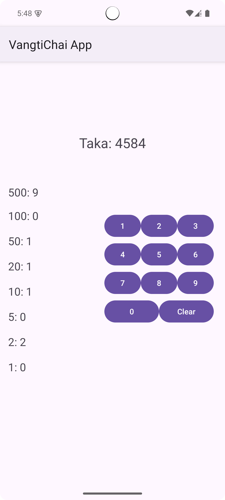

# 💵 Vangtichai

An Android app built as one of my first practice projects in an Android development course. This app calculates the minimum number of currency notes needed to make up a given amount while ensuring data persistence on screen rotation using **ViewModel**. 🚀

---

## ✨ Features

- 🔢 **Input Any Amount** – Enter a number, and the app breaks it down into the least number of notes.
- 💾 **State Persistence** – Values remain even when the screen is rotated, thanks to ViewModel.
- 🎨 **Simple & Clean UI** – Easy-to-use interface for quick calculations.
- 🚀 **Lightweight & Fast** – Works efficiently without unnecessary overhead.

---

## 🛠 Technologies Used

- **Kotlin** – For Android development.
- **ViewModel** – To retain data across configuration changes.

---

## 📸 Screenshots
 

---

## 🚀 Getting Started

### Clone the Repository
```sh
git clone https://github.com/asiradnan/vangtichai.git
```

### Build & Run
1. Open the project in **Android Studio**.
2. Sync dependencies and build the project.
3. Run on an emulator or physical device.

---

## 📌 Roadmap
- [ ] Enhanced UI/UX with Jetpack Compose 🎨
- [ ] Option to enter custom denominations ✍️

---

## 🤝 Contributing
Pull requests are welcome! If you find a bug or have a feature request, feel free to open an issue. 🙌

---

## 📄 License
This project is **open-source** and available under the **MIT License**.

---

## 💬 Connect With Me
- 🔗 [LinkedIn](https://linkedin.com/in/asiradnan)
- 📧 Email: hello@asiradnan.com

---

Give this repo a ⭐ if you found it useful! 😃

